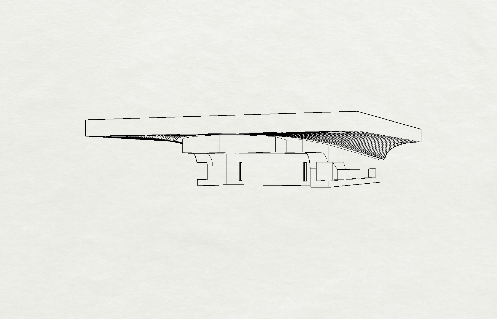
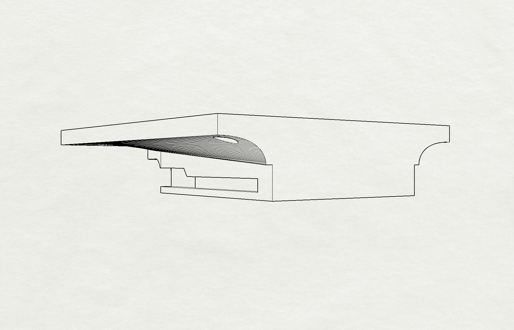
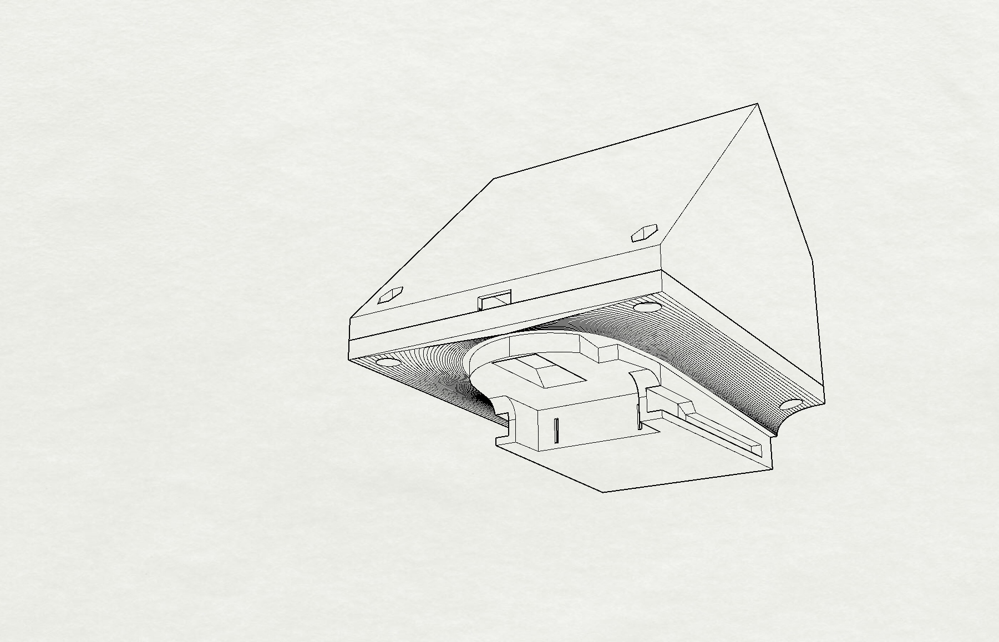
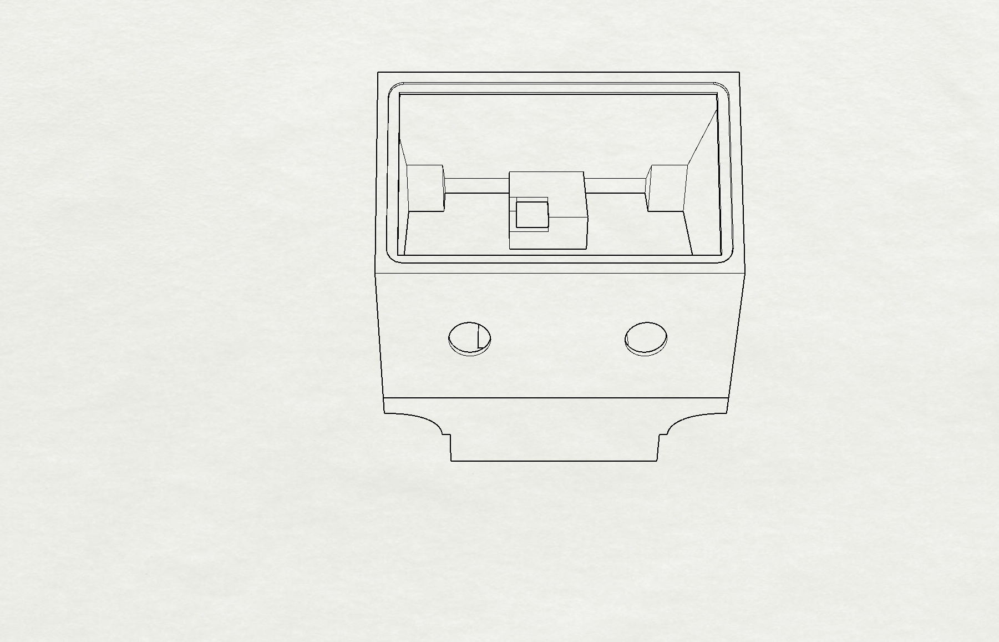
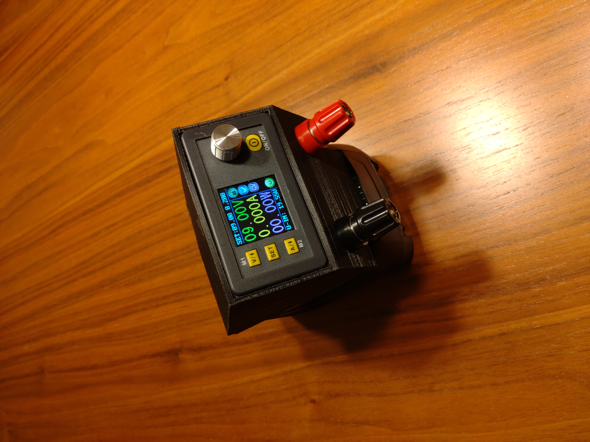
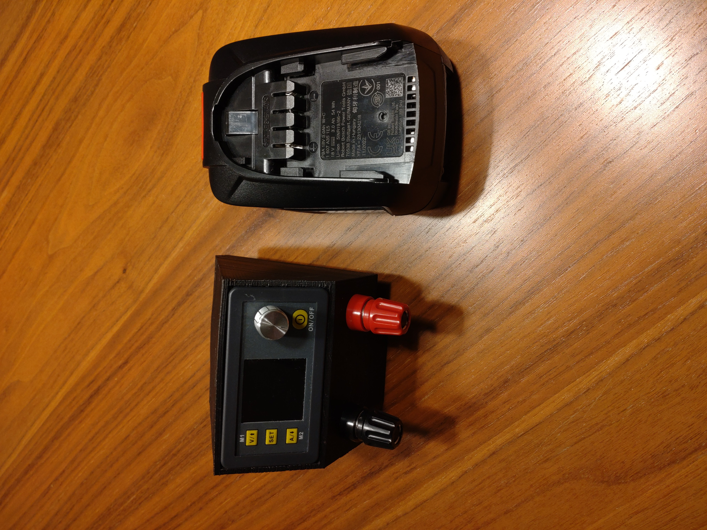
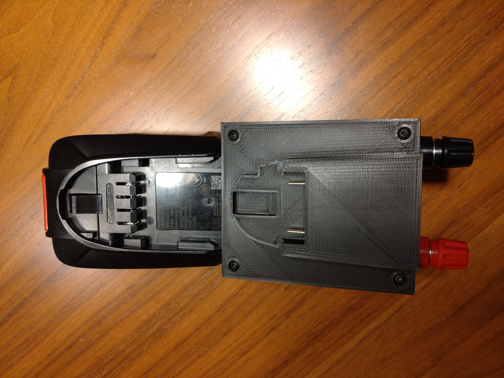

# DPS3005 to Bosch PBA-battery enclosure
3D printable enclosure adapter for DPS3005 PSU to fit on Bosch (green home tools) 18V batteries.
Created with Rhino 7.

#### 3D Case
The enclosure consists of 2 parts which are screwed together. 
The Micro-USB adapter board is located on the backside and fits into a frame.

Requirements:
* 3D printer 
* Filament of your choice
* 4 x 3 mm screws with nut
* red and black banana jacks (I used 63A Hirschmann banana jacks)

#### 3D view

 
 
 
 

#### Printed part

 
 
 

